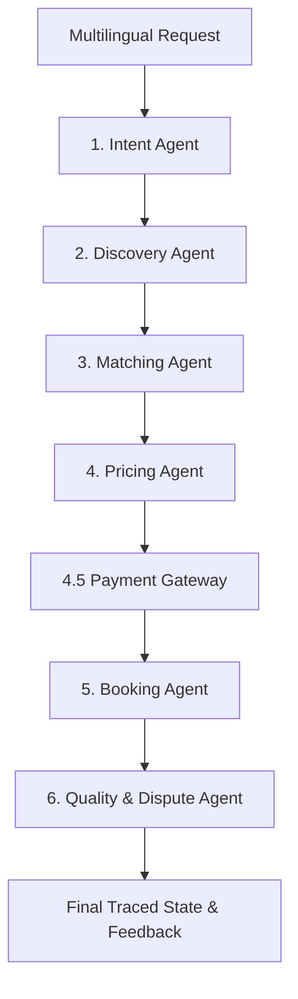

# ServisAI — AI Service Orchestrator for Pakistan's Informal Economy

ServisAI is a premium, multi-agent AI orchestrator designed specifically to convert noisy, multilingual, and mixed-language user requests (Urdu, Roman Urdu, English) into complete service transaction lifecycles. 

By bridging the gap between natural language complexity and deterministic business operations, ServisAI supports Pakistan's service workers and customers with transparent, resilient, and stateful transactions.

---

## 🛠️ The 6-Agent Pipeline Architecture

The workflow is orchestrated sequentially, passing transaction states across six specialized cognitive and mathematical agents:



1. **Intent Agent** ([intent_agent.py](file:///c:/Users/Administrator/Documents/GOOGLEHACK/google-hackathon/backend/agents/intent_agent.py)): Parses Roman Urdu, Arabic-script Urdu, and mixed languages to extract service type, location, urgency, and budget constraints.
2. **Discovery Agent** ([discovery_agent.py](file:///c:/Users/Administrator/Documents/GOOGLEHACK/google-hackathon/backend/agents/discovery_agent.py)): Queries Google Maps/Places API (with mock fallback resilience) to find relevant local providers.
3. **Matching Agent** ([matching_agent.py](file:///c:/Users/Administrator/Documents/GOOGLEHACK/google-hackathon/backend/agents/matching_agent.py)): Scores candidates using dynamic 10-factor weights (risk score, on-time score, rating, review count, recency, distance decay, etc) and ranks them.
4. **Pricing Agent** ([pricing_agent.py](file:///c:/Users/Administrator/Documents/GOOGLEHACK/google-hackathon/backend/agents/pricing_agent.py)): Computes precise visit fees, distance fares, urgency/complexity surcharges, and estimated materials.
5. **Payment Step** ([payment_tool.py](file:///c:/Users/Administrator/Documents/GOOGLEHACK/google-hackathon/backend/tools/payment_tool.py)): Simulates transaction ledgers with deterministic failure fallbacks (e.g., auto-routing failed digital transactions to Cash on Delivery).
6. **Booking Agent** ([booking_agent.py](file:///c:/Users/Administrator/Documents/GOOGLEHACK/google-hackathon/backend/agents/booking_agent.py)): Simulates real-time double-booking calendar conflicts utilizing dynamic travel-time buffers, returning alternative slots/providers or confirming schedules.
7. **Quality & Dispute Agent** ([quality_agent.py](file:///c:/Users/Administrator/Documents/GOOGLEHACK/google-hackathon/backend/agents/quality_agent.py)): Mutates Bayesian reputation averages based on user feedback, resolves minor disputes automatically, and escalates severe issues to the human operations tier.


---

## 🚀 Running the Program with Uvicorn

FastAPI serves as the API gateway wrapper for ServisAI, exposing endpoints for individual stages and end-to-end simulation runs.

### 1. Installation & Environment Setup
Clone the repository and install all required modules using the verified [requirements.txt](file:///c:/Users/Administrator/Documents/GOOGLEHACK/google-hackathon/backend/requirements.txt):
```bash
pip install -r backend/requirements.txt
```

Create a `.env` file in the `backend/` directory specifying your API keys:
```env
GROQ_API_KEY=your_groq_api_key_here
```
*(Note: Standalone agents are designed with 100% deterministic fallbacks, allowing full execution even if API keys are absent).*

### 2. Start the Backend Server
Run `uvicorn` from the `backend/` directory to boot up the API gateway:
```bash
cd backend
uvicorn main:app --reload
```

Once running, open your browser and navigate to:
* **Interactive API Documentation (Swagger UI)**: [http://127.0.0.1:8000/docs](http://127.0.0.1:8000/docs)
* **Active Subsystem Health Check**: [http://127.0.0.1:8000/api/health](http://127.0.0.1:8000/api/health)

---

## 🔍 Debug Mode, LLM Switching, and Active Health

### 1. ⚙️ Enabling `DEBUG` Mode
Set `DEBUG=true` in your backend `.env` file. This activates real-time, comprehensive logging of the entire multi-agent transaction pipeline:
- Logs all incoming HTTP gateway request payloads and outgoing JSON responses.
- Records all internal model agent trace logs conforming to the Team Trace Contract.
- Appends clean JSON line output to the persistent [debug_traces.log](file:///c:/Users/Administrator/Documents/GOOGLEHACK/google-hackathon/backend/debug_traces.log) file.

### 2. 🔌 Centralized Lazy-Loaded LLM Provider Switcher
ServisAI utilizes a robust, central provider switcher (`llm_provider.py`) loaded dynamically via your configuration list:
* **Lazy Client Initialization**: Eliminates frustrating console and server startup warnings like `Both GOOGLE_API_KEY and GEMINI_API_KEY are set` by delaying OpenAI, GenAI, and OpenRouter instantiations until an active chat generation is requested.
* **Dynamic Configuration List (`llm_provider_list.json`)**: Reads available models, provider definitions, and default priority order from a localized configuration file. If a file is absent, the system falls back to robust presets.
* **Model-Level Retry Loops**: Within each preferred provider, the text justification engine automatically loops through the array of listed models. If a model fails to reply or encounters an API exception, the tool **automatically retries** with the next model in the list.
* **Multi-Provider Failover**: If all models under the selected provider fail, the system cascades cleanly down to the next priority provider (Groq ──> Gemini ──> OpenRouter) in the precedence chain to guarantee transaction continuity.
* **Global Switching**: Set `LLM_PROVIDER=groq`, `LLM_PROVIDER=gemini`, or `LLM_PROVIDER=openrouter` in your `.env` file to set global defaults. Use `USE_GEMINI=true` to globally default to Gemini for presentation modes.
* **Granular Request Override**: Pass `"use_gemini": true` inside any API payload to override the default system for that specific request execution.

### 3. 🩺 Upgraded Active Subsystem Health Checker
The `/api/health` gateway endpoint acts as a live, diagnostic control center. Instead of returning static strings, it performs active ping checks verifying:
- Groq, Gemini, and OpenRouter LLM credentials.
- Google Maps geocoding connection status (or mock database fallback mode).
- Internal database availability and pricing math validation.

### 4. 👥 Conversational Response Roles Contract
To support conversational history and standard chat schema representations, all gateway endpoint responses carry a standardized metadata contract:
* **`role: "agent"`**: Appended directly at the root level of every JSON payload returned by the FastAPI server to indicate the sender representation.
* **`user_query`**: carries the user's initial inputs, marked with `"role": "user"`, e.g.:
  ```json
  "user_query": {
    "role": "user",
    "message": "Urgent electrician required in G-13 Islamabad"
  }
  ```

---

## 📡 API Gateway Endpoints & curl Manual Testing

All endpoints can be manually queried when `uvicorn` is running.

---

### 1. 🟢 `POST /api/pipeline` — End-to-End Simulation
Runs all 6 agents sequentially, simulating a complete transaction lifecycle (Intent ──> Discovery ──> Matching ──> Pricing ──> Booking ──> Quality).

* **curl Command**:
  ```bash
  curl -X POST http://127.0.0.1:8000/api/pipeline -H "Content-Type: application/json" -d "{\"message\": \"Urgent electrician required in G-13 Islamabad\", \"appointment_time\": \"2026-05-18 15:00\", \"rating\": 5, \"review_text\": \"Highly professional work by the partner!\", \"issue_reported\": false}"
  ```

---

### 2. 🟢 `POST /api/intent` — Intent Parsing Agent
Parses Roman Urdu, Arabic-script Urdu, or English requests into structured intents.

* **curl Command**:
  ```bash
  curl -X POST http://127.0.0.1:8000/api/intent -H "Content-Type: application/json" -d "{\"message\": \"Aap se AC saaf karwana hai, urgent.\", \"user_id\": \"test\"}"
  ```

---

### 3. 🟢 `POST /api/discovery` — Provider Discovery Agent
Finds nearby service providers using the location intent.

* **curl Command**:
  ```bash
  curl -X POST http://127.0.0.1:8000/api/discovery -H "Content-Type: application/json" -d "{\"message\": \"I need a plumber in Karachi\", \"user_id\": \"test\"}"
  ```

---

### 4. 🟡 `POST /api/pricing` — Dynamic Pricing Agent
Computes dynamic quotes for matched providers including surcharges and multilingual explanations.

* **curl Command**:
  ```bash
  curl -X POST http://127.0.0.1:8000/api/pricing -H "Content-Type: application/json" -d "{\"state\": {\"intent\": {\"service_type\": \"AC repair\", \"urgency\": \"urgent\", \"job_complexity\": \"intermediate\", \"language_detected\": \"roman_urdu\"}, \"providers\": [{\"name\": \"Kamran Ghori\", \"base_rate\": 500, \"per_km_rate\": 25, \"distance_km\": 3.5}]}}"
  ```

---

### 5. 🔵 `POST /api/booking` — Standalone Booking Agent
Simulates calendar slot double-booking check and live-journey progress milestone tracking.

* **curl Command**:
  ```bash
  curl -X POST http://127.0.0.1:8000/api/booking -H "Content-Type: application/json" -d "{\"state\": {\"pricing\": {\"provider_name\": \"Rizwan Plumber\", \"price_breakdown\": {\"total_price\": 1950.0}}, \"intent\": {\"language_detected\": \"english\"}, \"booking_request\": {\"appointment_time\": \"2026-05-18 15:00\", \"user_confirmed\": true}}}"
  ```

---

### 6. 🔴 `POST /api/quality` — Quality & Dispute Agent
Recalculates reputation Bayesian averages, scans review sentiments, and processes dispute actions.

* **curl Command**:
  ```bash
  curl -X POST http://127.0.0.1:8000/api/quality -H "Content-Type: application/json" -d "{\"state\": {\"booking\": {\"booking_id\": \"BK-78901\", \"provider_name\": \"Capital Electric\"}, \"intent\": {\"language_detected\": \"roman_urdu\"}, \"quality_request\": {\"booking_id\": \"BK-78901\", \"provider_name\": \"Capital Electric\", \"rating\": 2, \"review_text\": \"Late aya aur kaam kharab tha.\", \"issue_reported\": true}}}"
  ```

---

### 7. 🟠 `POST /api/escalation` — Human Tier Escalation
Receives tickets automatically flagged by the Quality Agent for manual human review and resolution.

* **curl Command**:
  ```bash
  curl -X POST http://127.0.0.1:8000/api/escalation -H "Content-Type: application/json" -d "{\"booking_id\": \"BK-123\", \"provider_name\": \"Capital Electric\", \"escalation_reason\": \"Severe safety risk reported\"}"
  ```

---

## 🧪 Testing the Program

ServisAI features 100% test coverage for standalone agent boundaries and end-to-end pipeline integrations.

### Running with Pytest
Execute `pytest` from the `backend/` directory to run the full test suite automatically:
```bash
cd backend
pytest tests/ -v
```

### Running Standalone Test Scripts
You can also run individual agent test scripts directly in Python to inspect detailed console trace logs and outputs:

```bash
# Test Gemini/Groq dynamic LLM provider switcher
python tests/test_gemini_switch.py

# Test Pricing Agent calculations and multilingual explanations
python tests/test_pricing_agent.py

# Test Booking Agent even/odd slots collision and fallbacks
python tests/test_booking_agent.py

# Test Quality Agent Bayesian reputation updates and dispute rules
python tests/test_quality_agent.py

# Test Full End-to-End simulation and Team Trace Contract validity
python tests/test_full_pipeline.py
```

---

## 📜 Team Trace Log Contract

Every agent in ServisAI records its operations in compliance with the shared team contract. Traces are aggregate-safe and return:
* **`step`**: Current phase (e.g. `pricing`, `booking`)
* **`agent_name`**: Class namespace recording the trace
* **`input` / `output`**: Dictionary snapshots of exact inputs and validated Pydantic outputs
* **`tool_called`**: Deterministic function executed
* **`duration_ms`**: Time spent on calculation
* **`status`**: Outcome descriptor (`success`, `fallback`, `error`, `clarification_needed`)
* **`reasoning_summary`**: Concise business rationale
